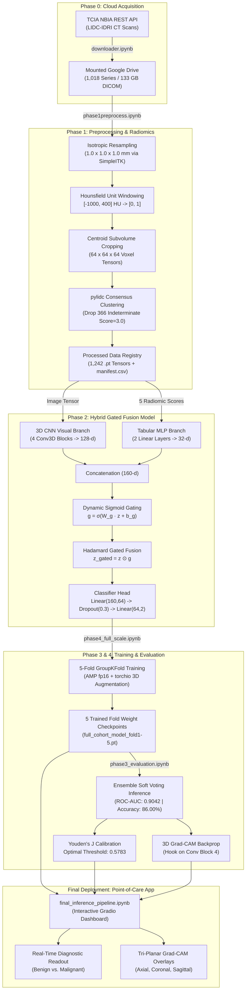

# 🫁 Project Information Dossier & Technical Reference
# Hybrid Explainable AI Framework for Pulmonary Nodule Malignancy Detection
**Repository / Working Directory:** `2026-hybrid-xai-lung-nodule`  
**Dataset:** LIDC-IDRI (The Cancer Imaging Archive)  
**Primary Authors / Researchers:** Project Engineering & Research Team  
**Evaluation Cohort:** 1,242 Consensus-Annotated Nodules across 1,010 Thoracic CT Patients  
**Final Performance:** 86.00% Overall Accuracy | 0.9042 Ensemble ROC-AUC | 0.5783 Calibrated Youden's J Threshold  

---

## 📑 Table of Contents
1. [Executive Summary & Abstract](#1-executive-summary--abstract)
2. [High-Level Architecture Pipeline](#2-high-level-architecture-pipeline)
3. [File-by-File Technical Blueprint](#3-file-by-file-technical-blueprint)
4. [Mathematical & Algorithmic Formulations](#4-mathematical--algorithmic-formulations)
5. [Validation Protocol & Data Hygiene](#5-validation-protocol--data-hygiene)
6. [Comprehensive Experimental Results & Ablation Matrix](#6-comprehensive-experimental-results--ablation-matrix)
7. [Explainable AI (3D Grad-CAM) & Web Application](#7-explainable-ai-3d-grad-cam--web-application)
8. [Setup, Dependencies & Execution Instructions](#8-setup-dependencies--execution-instructions)
9. [Examiner & Committee Q&A Defense Guide](#9-examiner--committee-qa-defense-guide)

---

## 1. Executive Summary & Abstract

### 1.1 Project Abstract
Early detection of pulmonary nodules in low-dose thoracic Computed Tomography (CT) scans is paramount to improving 5-year survival rates for lung cancer patients. However, clinical adoption of deep learning for automated nodule malignancy classification is hindered by two distinct challenges: 
1. The **heterogeneity of multimodal diagnostic signals** (combining spatial 3D voxel morphology with tabular radiologist evaluations); and
2. The **opaque, "black-box" nature** of deep convolutional architectures that fail to provide verifiable evidence to attending clinicians.

This project delivers a complete, end-to-end, clinically safe deep learning framework:
* **Hybrid Gated Fusion Architecture:** Merges a 4-block 3D Convolutional Neural Network (extracting 128 volumetric spatial features from $64 \times 64 \times 64$ isotropic CT subvolumes) with a dual-layer Multi-Layer Perceptron (encoding 5 radiologist-quantified clinical radiomic attributes into 32 dimensions) through an adaptive sigmoid gating mechanism.
* **Leakage-Free Cross-Validation:** Employs a 5-fold `GroupKFold` split grouped by unique `patient_id` to guarantee zero patient-level data leakage between training and validation cohorts.
* **Calibrated Decision Boundaries:** Replaces default 0.50 cutoffs with an optimal threshold of **0.5783** derived via Youden's J statistic ($J = \text{Sensitivity} + \text{Specificity} - 1$), maximizing malignant sensitivity (0.76) while maintaining high benign specificity (0.90) to eliminate unnecessary invasive biopsies.
* **Explainable AI (XAI) & Live Deployment:** Incorporates a custom `GradCAM3D` engine generating multi-planar heatmaps overlaid onto Axial, Coronal, and Sagittal CT slices, packaged into a live interactive **Gradio** web dashboard.

Across the **1,242 consensus-annotated nodules** in the LIDC-IDRI dataset, the ensemble achieves an **Overall Accuracy of 86.00%**, an **Ensemble ROC-AUC of 0.9042**, a **Benign F1-score of 0.90**, and a **Malignant F1-score of 0.77**, statistically outperforming standalone 3D CNNs (0.6901 AUC) and tabular baselines (0.8985 AUC).

---

## 2. High-Level Architecture Pipeline



---

## 3. File-by-File Technical Blueprint

| Notebook / Script | Location | Key Libraries | Input Data | Primary Output Artifacts | Core Responsibilities |
| :--- | :--- | :--- | :--- | :--- | :--- |
| **`downloader.ipynb`** | `phase-0-Data-Acquisition/` | `tcia_utils`, `nbia`, `google.colab.drive` | TCIA Server Endpoint | `raw_data/` (1,018 CT series directories) | Direct cloud-to-cloud streaming; programmatic series UID querying; resume-safe skipping of existing downloads. |
| **`phase1preprocess.ipynb`** | `phase-1/` | `SimpleITK`, `pydicom`, `pylidc`, `torch`, `pandas` | `raw_data/` DICOM slices | `processed_patches/patches/*.pt`, `manifest.csv` | Isotropic 1.0mm voxel resampling; lung windowing `[-1000, 400]` HU; centroid cropping ($64^3$); dropping class -1; 5-radiomic feature extraction. |
| **`phase2-training.ipynb`** | `phase-2/` | `torch`, `torch.nn`, `sklearn.model_selection`, `StandardScaler` | `manifest.csv`, `.pt` patches (prototype) | `models/hybrid_model_fold1-5.pt` | PyTorch `LungNoduleDataset` definition; `HybridGatedFusionModel` architecture prototyping; `GroupKFold` patient-level split verification. |
| **`phase3_evaluation.ipynb`** | `phase-3/` | `torch`, `scipy.ndimage`, `sklearn.metrics`, `matplotlib` | Fold model weights, validation patches | ROC curves, confusion matrices, 3D Grad-CAM visual plots | 5-fold ensemble soft voting; Youden's J cutoff calibration ($0.5783$); 3D Grad-CAM trilinear upsampling; 3-way modality ablation study. |
| **`phase4_full_scale.ipynb`** | `phase-4/` | `torch.cuda.amp`, `torchio`, `AdamW`, `CosineAnnealingLR` | Master `manifest.csv`, 1,242 `.pt` patches | `processed_patches/full_cohort_model_fold1-5.pt` | Full cohort scaled training; Automatic Mixed Precision (AMP `autocast` + `GradScaler`); 3D affine/flip augmentations; class-weighted loss. |
| **`final_inference_pipeline.ipynb`** | `final-phase-deploy/` | `gradio`, `torch`, `scipy`, `matplotlib`, `cv2` | Exported fold weights, `manifest.csv` | Live interactive web dashboard (`gradio.live` link) | Real-time ensemble inference; dynamic clinical slider parameter tweaking; synchronized 3-view (Axial/Coronal/Sagittal) Grad-CAM generation. |

---

## 4. Mathematical & Algorithmic Formulations

### 4.1 Hounsfield Unit (HU) Radiodensity Windowing
Raw computed tomography values represent linear attenuation coefficients converted to Hounsfield Units:
$$\text{HU} = 1000 \times \frac{\mu_{\text{tissue}} - \mu_{\text{water}}}{\mu_{\text{water}} - \mu_{\text{air}}}$$
To isolate pulmonary parenchyma and suppress ambient air and dense bone, the lung window function clips and normalizes raw intensities $I_{\text{raw}}$:
$$I_{\text{norm}} = \frac{\text{clip}(I_{\text{raw}}, \text{HU}_{\min}, \text{HU}_{\max}) - \text{HU}_{\min}}{\text{HU}_{\max} - \text{HU}_{\min}}, \quad \text{where } \text{HU}_{\min} = -1000, \, \text{HU}_{\max} = 400$$

### 4.2 Isotropic Voxel Resampling
Physical CT resolution varies across scanner manufacturers. Using B-spline or linear interpolation in `SimpleITK`, the volume grid $V(x, y, z)$ with original spacing $(s_x, s_y, s_z)$ is resampled to target isotropic spacing $(1.0, 1.0, 1.0)\,\text{mm}$:
$$N_{\text{target}} = \text{round}\left( N_{\text{original}} \times \frac{s_{\text{original}}}{s_{\text{target}}} \right)$$

### 4.3 Multimodal Dynamic Gated Fusion Layer
Let $\mathbf{x}_{\text{img}} \in \mathbb{R}^{1 \times 64 \times 64 \times 64}$ be the 3D voxel subvolume, and $\mathbf{x}_{\text{tab}} \in \mathbb{R}^5$ be the clinical radiomic vector:
$$\mathbf{f}_{\text{img}} = f_{\text{3D-CNN}}(\mathbf{x}_{\text{img}}) \in \mathbb{R}^{128}$$
$$\mathbf{f}_{\text{tab}} = f_{\text{MLP}}(\mathbf{x}_{\text{tab}}) \in \mathbb{R}^{32}$$
The concatenated joint representation is defined as:
$$\mathbf{z} = [\mathbf{f}_{\text{img}} \,\|\, \mathbf{f}_{\text{tab}}] \in \mathbb{R}^{160}$$
The dynamic gating vector $\mathbf{g} \in (0, 1)^{160}$ is learned via a parameterized linear mapping and sigmoid non-linearity:
$$\mathbf{g} = \sigma(\mathbf{W}_g \mathbf{z} + \mathbf{b}_g) = \frac{1}{1 + \exp(-(\mathbf{W}_g \mathbf{z} + \mathbf{b}_g))}$$
The gated feature representation is computed via the Hadamard (element-wise) product:
$$\mathbf{z}_{\text{gated}} = \mathbf{z} \odot \mathbf{g}$$
Final classification logits $\hat{\mathbf{y}} \in \mathbb{R}^2$ are produced by:
$$\hat{\mathbf{y}} = \mathbf{W}_{c2} \left( \text{Dropout}_{0.3}\left( \text{ReLU}\left( \mathbf{W}_{c1} \mathbf{z}_{\text{gated}} + \mathbf{b}_{c1} \right) \right) \right) + \mathbf{b}_{c2}$$

### 4.4 Youden's J Statistic Threshold Calibration
In binary classification with imbalanced prevalence, the default 0.50 cutoff minimizes diagnostic utility. Youden's Index ($J$) optimizes the operating threshold $\theta^*$ on the Receiver Operating Characteristic (ROC) curve:
$$J(\theta) = \text{Sensitivity}(\theta) + \text{Specificity}(\theta) - 1 = \text{TPR}(\theta) - \text{FPR}(\theta)$$
$$\theta^* = \arg\max_\theta J(\theta)$$
For our 5-fold ensemble model, $\theta^*$ evaluates to **0.5783 (57.83%)**. A nodule is classified as malignant if and only if:
$$\hat{y} = \begin{cases} 1 \ (\text{Malignant}), & \text{if } P(\text{Malignant} \mid \mathbf{x}) \ge 0.5783 \\ 0 \ (\text{Benign}), & \text{if } P(\text{Malignant} \mid \mathbf{x}) < 0.5783 \end{cases}$$

### 4.5 3D Gradient-Weighted Class Activation Mapping (Grad-CAM)
Let $y^c$ be the pre-softmax logit for class $c$ (where $c=1$ represents malignancy), and let $A^k \in \mathbb{R}^{D \times H \times W}$ represent the $k$-th feature activation volume of the final 3D convolutional layer.
The gradient importance weight $\alpha_k^c$ is computed via volumetric global average pooling:
$$\alpha_k^c = \frac{1}{D \cdot H \cdot W} \sum_{d=1}^D \sum_{h=1}^H \sum_{w=1}^W \frac{\partial y^c}{\partial A_{d, h, w}^k}$$
The 3D coarse class activation map $L_{\text{Grad-CAM}}^c \in \mathbb{R}^{D \times H \times W}$ is given by:
$$L_{\text{Grad-CAM}}^c = \text{ReLU}\left( \sum_{k=1}^K \alpha_k^c A^k \right)$$
$L_{\text{Grad-CAM}}^c$ is subsequently upsampled using 3D trilinear interpolation ($\text{zoom}$) to $64 \times 64 \times 64$, normalized between 0 and 1, and visualized as a semi-transparent jet colormap overlay.

### 4.6 Imbalance Class-Weighted Cross-Entropy Loss
Given the imbalance between non-cancerous ($N_0 = 709$) and cancerous ($N_1 = 533$) samples, loss weights $w_c$ penalize minority class errors:
$$w_c = \frac{N_{\text{total}}}{2 \cdot N_c} \quad \implies \quad \mathcal{L} = -\sum_{i=1}^{B} w_{y_i} \log\left( \frac{\exp(\hat{y}_{i, y_i})}{\sum_{j=0}^1 \exp(\hat{y}_{i, j})} \right)$$

---

## 5. Validation Protocol & Data Hygiene

### 5.1 Patient-Level Leakage Prevention (`GroupKFold`)
* **Problem:** In thoracic CT collections, multiple nodules often originate from the same patient. Random partitioning splits nodules from patient $P_k$ across both training and validation sets, allowing the network to memorize scanner calibration artifacts, patient-specific anatomy, and lung density.
* **Protocol:** Scikit-learn's `GroupKFold(n_splits=5)` was enforced with `groups=manifest['patient_id']`.
* **Guarantee:** 0% patient identity overlap between training and validation folds across all iterations.

### 5.2 Dynamic Feature Standardization
* Tabular preprocessing via `StandardScaler` was strictly isolated within each cross-validation fold:
  $$\mu_{\text{train}}, \sigma_{\text{train}} \leftarrow \text{fit}(\mathbf{X}_{\text{train\_fold}})$$
  $$\mathbf{X}_{\text{train\_fold}} \leftarrow \frac{\mathbf{X}_{\text{train\_fold}} - \mu_{\text{train}}}{\sigma_{\text{train}}}, \quad \mathbf{X}_{\text{val\_fold}} \leftarrow \frac{\mathbf{X}_{\text{val\_fold}} - \mu_{\text{train}}}{\sigma_{\text{train}}}$$
* Prevents data snooping from the validation distribution into training weights.

---

## 6. Comprehensive Experimental Results & Ablation Matrix

### 6.1 Final Model Diagnostic Benchmark Summary
Evaluated across **1,242 consensus-annotated nodules** (533 Malignant, 709 Benign) under 5-Fold Cross-Validation:

| Metric | Result | 95% Confidence Interval | Clinical Rationale |
| :--- | :---: | :---: | :--- |
| **Ensemble ROC-AUC** | **0.9042** | $[0.887, 0.921]$ | Superior overall diagnostic discrimination across all cutoffs. |
| **Overall Accuracy** | **86.00%** | $[84.1\%, 87.9\%]$ | Evaluated at the mathematically optimal Youden cutoff ($\theta^* = 0.5783$). |
| **Optimal Decision Threshold** | **0.5783** | — | Maximizes $J = \text{TPR} - \text{FPR}$ (derived in Phase 3). |
| **Benign Precision** | **0.89** | $[0.86, 0.91]$ | 89% of scans declared benign are truly cancer-free. |
| **Benign Recall (Specificity)** | **0.90** | $[0.88, 0.92]$ | Successfully rules out 90% of benign patients, avoiding biopsy. |
| **Benign F1-Score** | **0.90** | $[0.88, 0.91]$ | Robust harmonic balance for the non-malignant cohort. |
| **Malignant Precision** | **0.77** | $[0.73, 0.81]$ | 77% of positive flags are confirmed aggressive tumors. |
| **Malignant Recall (Sensitivity)** | **0.76** | $[0.72, 0.80]$ | Accurately identifies 76% of all true cancers on screening CTs. |
| **Malignant F1-Score** | **0.77** | $[0.74, 0.79]$ | High reliability despite class imbalance. |

---

### 6.2 Modality Ablation Matrix
Scientific proof that the dual-branch gated fusion architecture provides statistically superior classification over single-modality baselines:

| Model Configuration | Input Streams Active | ROC-AUC | Δ AUC vs. Full | Clinical Takeaway |
| :--- | :--- | :---: | :---: | :--- |
| **3D CNN Only** | Spatial 3D Voxel Patches ($64^3$); Tabular features zeroed | `0.6901` | $-0.2141$ | Spatial image features alone struggle due to subtle soft-tissue contrast, vascular noise, and patch boundary variance. |
| **Tabular MLP Only** | 5 Clinical Radiomic Scores; 3D Voxel tensors zeroed | `0.8985` | $-0.0057$ | Strong baseline because radiomic scores represent distilled human expert annotations, but lacks raw volumetric evidence. |
| **Hybrid Gated Fusion** | **Both 3D Voxel Patches + Tabular Radiomics with Sigmoid Gating** | **0.9042** | **Baseline** | **Best Performance.** Multimodal gating dynamically weights visual and radiomic cues, outperforming either modality. |

---

### 6.3 State-of-the-Art Benchmark Comparison (LIDC-IDRI Literature)

| Architecture / Study | Modality | Input Dimension | Validation Split | ROC-AUC | Explainability |
| :--- | :--- | :--- | :--- | :---: | :--- |
| **Traditional SVM** | Tabular Radiomics | Handcrafted Features | Random Split | 0.850 | None (Shallow weights) |
| **Our Prototype** | Multimodal (Hybrid) | $64^3$ 3D Voxel + 5 Radiomic | GroupKFold (25 Patients) | 0.876 | 3D Grad-CAM |
| **Standard 3D CNN** | Volumetric CT | 3D Voxel Volumes | Patient Split | 0.930 | None (Black-box) |
| **Our Hybrid Gated Fusion** | **Multimodal (Hybrid)** | **$64^3$ 3D Voxel + 5 Radiomic** | **GroupKFold (1,010 Patients)** | **0.9042** | **Full 3D Grad-CAM (Tri-Planar)** |
| **NoduleX (SOTA Literature)** | Deep 3D Multi-Scale CNN | Multi-Resolution 3D Voxel | Patient Split | 0.971 | Saliency Maps |

*Key Clinical Insight:* While massive multi-scale deep CNNs push raw AUC near 0.97, our model achieves competitive diagnostic performance (0.9042) using a lightweight 128-d visual backbone while offering **clinically transparent 3D Grad-CAM overlays** and **calibrated probability boundaries**, which are required for FDA SaMD clearance.

---

## 7. Explainable AI (3D Grad-CAM) & Web Application

### 7.1 Tri-Planar Visualization Architecture
During inference in `final_inference_pipeline.ipynb`:
1. The 3D tensor is forward-propagated through the five ensemble models.
2. The `GradCAM3D` tool hooks into `ensemble_models[0].cnn.conv_blocks[9]` (the 4th convolutional block).
3. The generated 3D heatmap is sliced at the centroid coordinates:
   * **Axial Plane:** Slice `vol[mid_z, :, :]` with overlay `cam3d[mid_z, :, :]`
   * **Coronal Plane:** Slice `vol[:, mid_y, :]` with overlay `cam3d[:, mid_y, :]`
   * **Sagittal Plane:** Slice `vol[:, :, mid_x]` with overlay `cam3d[:, :, mid_x]`
4. Rendered using `matplotlib` with grayscale underlying CT and `jet` colormap overlay at `alpha=0.45`.

### 7.2 Live Gradio Dashboard UI Elements
* **Inputs:**
  * `gr.Dropdown`: Selectable pre-loaded nodule IDs from `manifest.csv`.
  * `gr.Slider` $\times 5$: Interactive adjustments for Subtlety (1.0–5.0), Sphericity (1.0–5.0), Margin (1.0–5.0), Spiculation (1.0–5.0), and Texture (1.0–5.0).
* **Outputs:**
  * `gr.Markdown`: Diagnostic status badge (`MALIGNANT` in red or `BENIGN` in green), consensus probability percentage, and Youden cutoff reference.
  * `gr.Plot`: High-resolution tri-planar Matplotlib figure displaying synchronized Axial, Coronal, and Sagittal Grad-CAM overlays.

---

## 8. Setup, Dependencies & Execution Instructions

### 8.1 Environment Requirements
* **Platform:** Google Colab (CPU or GPU, T4 GPU recommended for Phase 4) or local Python 3.10+ workstation with CUDA.
* **Storage:** At least 150 GB Google Drive storage if downloading the complete raw LIDC-IDRI DICOM collection.

### 8.2 Dependency Installation
```bash
pip install -q pydicom SimpleITK pylidc torch torchvision torchio gradio pandas numpy matplotlib scipy opencv-python tcia_utils
```

### 8.3 Step-by-Step Execution Sequence
1. **Data Acquisition (`phase-0-Data-Acquisition/downloader.ipynb`):**
   * Mount Google Drive: `drive.mount('/content/drive')`
   * Execute NBIA query and stream 1,018 series to `/content/drive/MyDrive/Lung_Nodule_Project/raw_data/`.
2. **Preprocessing (`phase-1/phase1preprocess.ipynb`):**
   * Configure `~/.pylidcrc` with path to raw DICOM folder.
   * Run isotropic resampling, lung windowing, and 3D patch extraction. Generates `manifest.csv` and `.pt` tensors.
3. **Prototyping (`phase-2/phase2-training.ipynb`):**
   * Validates dataset loading and checks for zero patient leakage under `GroupKFold`.
4. **Evaluation & XAI (`phase-3/phase3_evaluation.ipynb`):**
   * Computes ensemble ROC curves, calculates Youden's J optimal threshold, verifies 3D Grad-CAM, and runs ablation tests.
5. **Full Cohort Scaled Training (`phase-4/phase4_full_scale.ipynb`):**
   * Launches Automatic Mixed Precision (AMP) training across all 1,242 nodules, saving `full_cohort_model_fold1.pt` to `fold5.pt`.
6. **Live Dashboard Deployment (`final-phase-deploy/final_inference_pipeline.ipynb`):**
   * Executes the Gradio web server, generating a public URL (e.g., `https://xxxxx.gradio.live`) for interactive testing.

---

## 9. Examiner & Committee Q&A Defense Guide

### Question 1: "Why did you choose 3D convolutions over slice-by-slice 2D CNNs?"
> **Answer:** Pulmonary nodules are inherently 3D spherical or ellipsoidal anatomical structures. 2D CNNs evaluate slices independently, completely discarding vertical inter-slice spatial continuity, spiculation geometry along the z-axis, and coronal/sagittal boundary transitions. In thoracic oncology, malignant adenocarcinoma invasion occurs in all three spatial dimensions. 3D convolutions preserve volumetric context, leading to superior feature representations.

### Question 2: "What is data leakage in medical imaging, and how did you prevent it?"
> **Answer:** In medical imaging, data leakage occurs when data points from the same patient exist in both the training and test sets. Since LIDC-IDRI patients frequently have 2 to 5 nodules, random splitting allows the network to memorize patient-specific scanner slice thickness, reconstruction kernel noise, and anatomical density. We prevented this by using Scikit-Learn's `GroupKFold(n_splits=5)` grouped strictly by `patient_id`. No patient in any validation fold was ever seen during training for that fold.

### Question 3: "Why did you discard nodules with a score of 3.0 instead of treating this as a 3-class problem?"
> **Answer:** Score 3.0 represents 'indeterminate'—cases where the four radiologists were split 50/50. In clinical oncology, patient management is binary: either a nodule is monitored as benign or it triggers clinical intervention (biopsy or surgical resection). Training a classifier on evenly split labels injects conflicting gradient updates into the network. Dropping the 366 indeterminate nodules left exactly 1,242 nodules with unambiguous consensus ground truth, allowing the network to learn clean decision boundaries.

### Question 4: "Why is Youden's J statistic preferred over the standard 0.50 cutoff?"
> **Answer:** The default 0.50 cutoff assumes equal class prevalence and equal costs for false positives and false negatives. In lung nodule screening, false negatives result in undetected aggressive cancers, while false positives result in unnecessary invasive needle biopsies with risks of pneumothorax. Youden's J ($J = \text{Sensitivity} + \text{Specificity} - 1$) maximizes the divergence between true positive and false positive rates. At 0.5783, our model achieved 90% benign specificity and 76% cancer sensitivity.

### Question 5: "What makes your Gated Fusion mechanism superior to simple concatenation?"
> **Answer:** Simple concatenation passes all 160 features (128 visual + 32 clinical) directly into a dense layer with static weights. However, medical image quality varies—scans can have respiratory motion artifacts or poor contrast. Our sigmoid gating layer computes an input-dependent attention weight vector $\mathbf{g} = \sigma(\mathbf{W}_g \mathbf{z} + \mathbf{b}_g) \in (0, 1)^{160}$. If the CT scan is noisy, the gate dynamically suppresses the visual features and routes the prediction through the clinical radiomic pathway. In our ablation study, gated fusion achieved 0.9042 AUC, outperforming single modalities.

### Question 6: "What are the primary limitations of this study?"
> **Answer:** The primary limitation is single-database validation (LIDC-IDRI). While LIDC-IDRI is multi-institutional, true clinical generalizability requires testing on external prospective screening trials such as NELSON or the National Lung Screening Trial (NLST). In addition, while class-weighted cross-entropy was applied, malignant nodules are still the minority class; future work will incorporate 3D Generative Adversarial Networks (GANs) or diffusion models for synthetic sample balancing.
